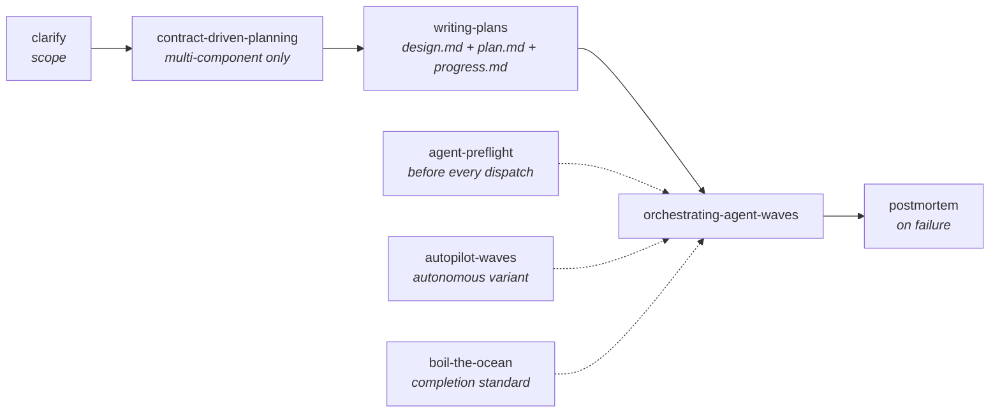

# Claude Code Wave-Orchestration Skills

Eight battle-tested [Claude Code](https://code.claude.com) skills for planning and executing multi-agent implementation work. Together they form a pipeline that takes a feature from ambiguous idea to verified, atomically-committed implementation — with subagents doing the work in parallel waves and hard gates between each wave.

These are not speculative templates: every skill here is validated by sustained real-world use (the core three were invoked 100+ times in the two months before publication).

## The pipeline



## The skills

| Skill | Role |
| --- | --- |
| `clarify` | Guided questioning to pin down scope, output format, and approach before any work starts. |
| `contract-driven-planning` | For multi-component systems (frontend + backend, producer + consumer): independent component designs plus an exact interface contract, so components can be built in parallel without drift. |
| `writing-plans` | Turns an approved spec into `docs/plans/YYYY-MM-DD-<feature>/` — a grounded `design.md` (every number re-derived from source), a task-by-task `plan.md` with verify gates and approval gates, and a scaffolded `progress.md` tracker for multi-wave plans. |
| `orchestrating-agent-waves` | Executes the plan in waves of parallel subagents. Scope contract before any dispatch; cross-boundary tests as wave gates; the orchestrator — not the agents — owns commits. |
| `autopilot-waves` | Delta on the above for walk-away runs: auto-detects failures, classifies them against a patch library, patches the next dispatch prompt, re-runs, and escalates only after two failed retries. Includes dry-run probe, verifier-prompt, and postmortem-lite templates. |
| `agent-preflight` | Pre-dispatch checklist for every subagent: required tools present, correct agent type, silent-failure and scope-drift detection on return. |
| `boil-the-ocean` | The completion standard: fix for correctness, not cosmetic green. Tests must probe the right thing; "pre-existing failure" is a signal to investigate, never an excuse. |
| `postmortem` | Structured root-cause analysis when an agent, wave, or pipeline fails. |

## Install

Copy the skill directories into `~/.claude/skills/` (user-level) or `<project>/.claude/skills/` (project-level):

```bash
cp -R skills/* ~/.claude/skills/
```

Each skill is then invocable as `/<skill-name>` and discoverable by Claude for autonomous invocation.

## Conventions the skills assume

- **Plans live on disk**, in `docs/plans/YYYY-MM-DD-<feature>/` (`design.md` + `plan.md`, plus a plan-local `progress.md` for multi-wave plans). The top-level `docs/plans/progress.md` is the committed index across plans; plan dirs themselves are typically gitignored.
- **Verify before commit.** Every task ends with the project's verify command (test suite, build, render) before an atomic commit. Fixes found during verification get a separate commit.
- **Approval gates.** Backend surface changes (new endpoints, schema changes, new service methods) are flagged `<APPROVAL-GATE>` in plans and require explicit user approval regardless of size.
- **Explicit scope.** Deferrals go in the plan header's "Out of scope" line — silent scope reduction is a refused pattern.

## Optional companions (referenced, not required)

Some skills mention companions that are not part of this set. Everything degrades gracefully without them:

- `spawn-team` — a coordinated-team alternative to waves, referenced by the wave skills' teams mode.
- `/plan` and a `.claude/memorybank/` directory — a session-continuity system; `clarify` records decisions there when it exists and skips when it doesn't.
- `~/.claude/hooks/` — optional hooks that mechanically detect silent agent failures; `agent-preflight` works without them.

## claude.ai artifact skills

`claude-ai-skills/` holds two skills for the **claude.ai Artifacts runtime** (not Claude Code — different environment, different constraints):

| Skill | Role |
| --- | --- |
| `artifact-creator` | Single-file React artifacts: library ecosystem reference (recharts, three, tone, papaparse, …) plus the runtime's hard rules (no localStorage, no `<form>` tags, chart.js via UMD script). |
| `artifact-project` | Complex multi-component artifacts: scaffold a React + TypeScript + Tailwind + shadcn/ui project, bundle it into a single self-contained HTML artifact, and optionally package compilable source for the user. Apache-2.0 (see its `LICENSE.txt`); derived from Anthropic's artifact-building skill with a local source-packaging extension. |

The source directories are canonical. To build an uploadable `.skill` bundle (zips are gitignored):

```bash
cd claude-ai-skills && zip -r ../<name>.skill <name>
```

## Status

Extracted from a private skill collection in July 2026. Skill content reflects lessons from ~6 months of daily multi-agent orchestration across production codebases.

## License

[Apache-2.0](LICENSE), repo-wide. `claude-ai-skills/artifact-project/` retains its own copy of the same license from its upstream derivation.
