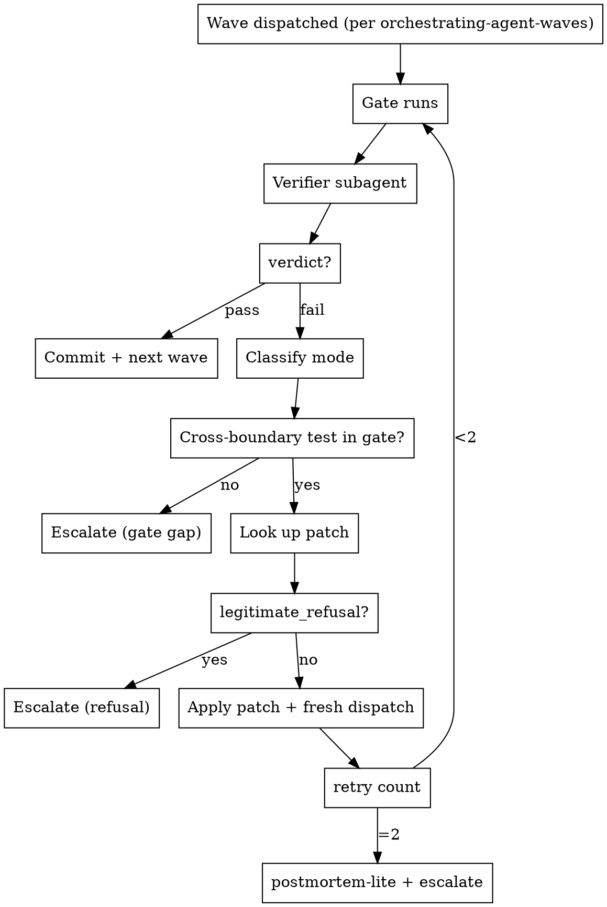

# Autopilot Waves

## Overview

An autopilot wrapper around `orchestrating-agent-waves`. After each wave's gate, a **verifier subagent** returns a structured verdict. On failure, the orchestrator looks up the mode in `failure-patches.md`, splices the patch into a fresh dispatch prompt, and re-runs. Two failures → escalation block, stop.

**Core insight:** The taxonomy is small (9 modes) and most fixes are mechanical. Once `agent-preflight` Gate 3 is encoded as an executable patch table, the orchestrator can apply it without round-tripping to the user for the common cases.

**This skill is a delta, not a replacement.** It plugs into the existing wave loop at exactly one point — between "gate" and "commit" — and exits the loop in exactly two places: gate-passes (commit + next wave) and retries-exhausted (escalate + stop).

## Prerequisites

- `orchestrating-agent-waves` is the substrate. Read it first; this skill assumes its vocabulary (waves, gates, SCOPE CONTRACT, agent-plan.md).
- `agent-preflight` Gates 1–3 still apply per individual dispatch. This skill does not replace them.
- `postmortem` is invoked only at retries-exhausted, as `postmortem-lite` (inline, ≤20 lines, no file output).
- `failure-patches.md` (sibling file in this skill dir) is the patch library. Read once at loop start.

## When to use

- The user explicitly authorizes auto-proceed across waves ("run all waves, only stop on real failures").
- The plan has ≥3 waves and the user does not want to be in the loop between each.
- Recurring same-class failures across recent sessions (check `~/.claude/projects/*/memory/` for patterns).

**When NOT to use:**

- First run of a new wave plan — verify the gates work manually before trusting auto-mode.
- Any wave whose gate lacks a cross-boundary test (see `orchestrating-agent-waves` §Gate Design). The loop will refuse to self-heal these — surface to user instead.
- Plans with <3 waves — overhead exceeds benefit.

## Pre-dispatch dry-run (optional but recommended)

Before dispatching a wave whose acceptance criteria include **numerical oracles the plan does not pin** (computed values, chain results, parsing outputs, geometric formulas), run a throwaway probe script first. The probe simulates the proposed algorithm against pinned fixtures using existing production code paths and dumps a per-fixture oracle table. That table becomes the source for `pytest.approx(...)` values in test-writing agents and a cross-check command for implementation agents.

See `templates/dry-run-probe.md` for the full pattern: when to use, probe-script skeleton, oracle dump format, how to wire into agent prompts, and cleanup.

**One-line decision rule:** if the plan would force the test-writing agent to *guess* an expected number, write a probe first. Cost is ~15–30 min orchestrator time; avoids at least one agent retry plus the cost of silently-wrong constants surfacing later.

## Plan-local progress tracker (MANDATORY)

Every multi-wave plan directory must contain a rolling `progress.md` that the orchestrator updates at each wave close. This is the handoff document for the next session — the file you'd hand to a cold-start Claude to resume the plan without re-deriving state from `git log` + the conversation.

### Where it lives

In the plan directory alongside the wave plan:

```
docs/plans/<date>-<feature>/
├── initial-status.md     # frozen truth reference (written once, never updated)
├── waves.md              # the plan + telemetry table (updated when waves close)
├── progress.md           # rolling handoff (updated at each wave close) ← THIS
└── <per-wave artifacts>  # audit docs, findings, decision docs
```

If `initial-status.md` doesn't exist for a plan, the orchestrator's first wave-close action is to create it (capturing the substrate at plan start) before writing `progress.md`.

For plans authored via `writing-plans`, `progress.md` is scaffolded at plan-save time (all waves Pending) — the orchestrator only updates it. If it's missing (plan predates the convention), create it at the first wave close.

### What it contains (in this order)

1. **Resume-here block** — exact commands to run at session start with expected outputs (top N commit hashes, test counts, lockstep counts). A cold-start Claude should be able to confirm substrate state in <60 seconds by running these.
2. **Wave status table** — one row per wave with status (Done / Pending / Blocked) and commit hashes for done waves.
3. **Last-wave closure summary** — what shipped, what was found, what changed about the substrate. Replace each session, not append.
4. **Side effects** — test count delta, DB rebuilds, new gitignored artifacts, anything that drifted from the substrate documented in `initial-status.md`.
5. **Next-session dispatch shape** — which wave(s) come next, parallel-safe groups, pre-dispatch probe requirements. Be concrete: name the agent type, name the dry-run probe file, name the gate command.
6. **Pointers** — links to companion docs in the plan directory plus the relevant skills.

### When the orchestrator updates it

`progress.md` is updated as part of the **wave-close commit** (Loop step 3 on pass). Update timing:

- At wave close (verdict: pass) → update wave status row to "Done"; update last-wave closure summary; update next-session dispatch shape; update side effects if substrate changed.
- At escalation (Loop step 4 fires) → update wave status row to "Blocked"; note blocker; do NOT advance next-session dispatch shape.
- Never append a changelog. `progress.md` is the **current state** — git history is the changelog.

### Why this exists

Without a plan-local rolling tracker, the orchestrator burns 5–15 minutes per session re-deriving state from `git log` + reading prior session's audit docs. The top-level `docs/plans/progress.md` (when present) is the index across plans; this `progress.md` is the live-state cache for the current plan. The two are complementary, not redundant.

## Workflow



## The Loop (per wave)

This runs in place of steps 3–6 of the `orchestrating-agent-waves` per-wave loop (GATE, COMMIT, TEARDOWN, UPDATE).

**Teammate lifecycle (agent-teams harness):** every dispatch this loop makes — wave agents, the verifier subagent (step 2), and re-dispatched retry agents (step 6) — is registered as a persistent teammate under `CLAUDE_CODE_EXPERIMENTAL_AGENT_TEAMS=1` and does **not** self-reap. The autopilot loop spawns *more* agents per wave than the base loop (one verifier per gate, plus up to two retries), so stale-agent buildup is worse here. Spawn every agent **anonymous + foreground** (no `name`, no `run_in_background`), and reap survivors at wave close — see step 3 and the `orchestrating-agent-waves` §Dispatch Model.

```
1. RUN GATE — Execute gate command from waves.md.

2. VERIFY — Dispatch wave-verifier subagent.
   Input:  wave's acceptance criteria + diff + gate stdout/stderr
   Output: {verdict: pass|fail, failure_mode: <taxonomy>, evidence: <files+lines>}
   See: templates/verifier-prompt.md

3. BRANCH on verdict:
   - pass → commit feature/test/docs + **update plan-local progress.md** (see §Plan-local progress tracker) + **TEARDOWN** (reap this wave's agents + the verifier + any retry agents: `TaskList` → `TaskStop` survivors; no-op if the teams flag is off) + next wave (exit loop)
   - fail → continue to step 4

4. SAFETY CHECKS (any "yes" → escalate, do not patch):
   - Does the gate include a cross-boundary test? (per §Gate Design)
   - Is failure_mode == legitimate_refusal?
   - Is retry_count already at 2?
   - Would the patch require expanding the SCOPE CONTRACT?

5. CLASSIFY + PATCH:
   - Look up failure_mode in failure-patches.md
   - Apply patch to next dispatch prompt (prepend / replace / split per the entry)
   - Apply subagent_type override if the patch specifies one
   - Increment retry_count for this wave

6. RE-DISPATCH — Fresh agent, patched prompt, single message.
   Apply agent-preflight Gates 1–3 as always.

7. GO TO 1.
```

## Verifier Subagent Contract

Dispatch with `subagent_type: general-purpose`, **anonymous + foreground** (no `name`, no `run_in_background` — so it reaps on return instead of lingering as a teammate), and a fixed prompt (see `templates/verifier-prompt.md`). The verifier must return parseable structured output:

```yaml
verdict: pass | fail
failure_mode: silent_failure | permission_gap | wrong_tool | scope_creep | context_overflow | wrong_understanding | quality_below_bar | test_regression | legitimate_refusal | null
confidence: high | medium | low
evidence:
  - file: path/to/file
    lines: "12-18"
    note: "why this is the signal"
gate_cross_boundary_test_present: true | false
```

**If `confidence: low`** → treat as escalation, do not auto-patch. The classifier is unsure; bring in the user.

**If `gate_cross_boundary_test_present: false`** → escalate with `gate gap` recommendation regardless of verdict.

## Retry Accounting

Per-wave state the orchestrator tracks:

```yaml
wave_N:
  retry_count: 0  # increments on each re-dispatch
  attempts:
    - mode: silent_failure
      patch: "tool contract prepended; subagent_type → general-purpose"
      result: fail
    - mode: scope_creep
      patch: "scope lock prepended with explicit off-limits"
      result: pass
```

**Escalation triggers** (any one stops the loop):

- `retry_count == 2` regardless of outcome on the next attempt.
- Two consecutive failures with **different** modes (suggests plan-level issue, not prompt issue).
- Any safety check from Loop step 4 fires.

## Escalation Path

When the loop exits via escalation:

1. **Print the escalation block** from `failure-patches.md` §Escalation Block, filled in with both attempts' modes, patches, and results.
2. **Invoke `postmortem-lite`** — inline triage, ≤20 lines, no file output. Use the `postmortem` skill's Step 1 (triage table) only; skip subagent dispatch and report generation.
3. **Stop.** Do not proceed to the next wave. Do not commit partial wave work. Wait for user direction.

Optional: if the user later says "proceed", reset `retry_count` to 0 for the failed wave and re-enter the loop.

## Invariants

| Rule | Why |
|------|-----|
| Loop only entered for waves with cross-boundary gates | Prevents confidently auto-closing broken waves |
| Patches modify the prompt, never the SCOPE CONTRACT | Preserves user-approved boundary |
| Fresh agent on every retry | Failed context is poisoned |
| All agents (wave, verifier, retries) spawned anonymous + foreground | Named/backgrounded dispatches become persistent teammates under the agent-teams flag and don't self-reap |
| No stale teammates after a wave closes | This loop spawns extra agents (verifier + retries); reap them all at wave close or they accumulate |
| Max 2 retries per wave | Bounds the loop |
| Different mode on retry #2 → escalate | Plan-level issue, not prompt-level |
| `legitimate_refusal` always escalates | The agent identified a real problem |
| Verifier `confidence: low` always escalates | Don't patch on guesses |
| Test-regression fixes come from orchestrator, not re-dispatched agent | Per `orchestrating-agent-waves` rule |
| Each retry's mode + patch logged in wave state | Audit trail for escalation block |
| Plan-local `progress.md` updated at every wave close | Next session must resume from the doc, not from `git log` |
| `progress.md` replaces last-wave summary in place, never appends | Git history is the changelog; this file is current state |

## Anti-Patterns

| Don't | Do instead |
|-------|------------|
| Auto-patch a wave with unit-tests-only gate | Refuse self-heal; surface gate gap |
| Loop more than twice | Escalate after retry #2 |
| Re-dispatch with the same prompt | Patch must change something concrete |
| Auto-retry a `legitimate_refusal` | Read the reason; surface or fix precondition |
| Expand SCOPE CONTRACT to satisfy a patch | Escalate; user re-approves expanded scope |
| Skip the verifier and classify inline | Verifier's structured output is the audit trail |
| Commit partial wave work on escalation | Leave wave uncommitted; user decides |
| Name/background the verifier or retry agents | Spawn anonymous + foreground so they reap on return |
| Carry a wave's verifier/retry agents into the next wave | `TaskList` + `TaskStop` survivors at wave close |
| Treat `confidence: low` verdicts as actionable | Treat as escalation |
| Dispatch a test-writing agent without pinned expected values | Run the dry-run probe first; pin every `pytest.approx(...)` from the oracle |
| Skip the `progress.md` update on wave close | Update it as part of the closing commit; next session can't resume without it |
| Append wave-by-wave narrative to `progress.md` | Replace last-wave summary in place; the file is current state, not a log |

## File Layout

```
~/.claude/skills/autopilot-waves/
├── SKILL.md              # This file — the loop contract
├── failure-patches.md    # Mode → patch library (9 modes)
└── templates/
    ├── verifier-prompt.md       # wave-verifier dispatch prompt
    ├── postmortem-lite.md       # inline triage format
    └── dry-run-probe.md         # pre-dispatch oracle probe pattern
```

## Quick Reference

```
Per wave (replacing GATE/COMMIT/UPDATE in orchestrating-agent-waves):
  1. Run gate command
  2. Dispatch verifier → {verdict, failure_mode, evidence, confidence}
  3. If pass → commit + update plan-local progress.md + TEARDOWN (reap wave/verifier/retry agents) → next wave
  4. Safety checks (gate gap | refusal | retry==2 | scope expansion) → escalate
  5. Look up patch in failure-patches.md
  6. Apply patch + subagent_type override → fresh dispatch (anonymous + foreground)
  7. Increment retry_count → back to 1

All dispatches anonymous + foreground (no name, no run_in_background) so they reap on return — see orchestrating-agent-waves §Dispatch Model.

Plan-local docs (in <plan-dir>/):
  initial-status.md  — frozen truth reference (created once)
  waves.md           — plan + telemetry table (updated as waves close)
  progress.md        — rolling handoff (UPDATED EVERY WAVE CLOSE)
  <wave>-*.md        — per-wave audit / findings / decision docs

On escalation:
  - Print escalation block
  - postmortem-lite inline
  - Stop, wait for user
```

## See Also

- `orchestrating-agent-waves` — the substrate this skill extends
- `agent-preflight` — per-dispatch hygiene (Gates 1–3), still applies
- `postmortem` — full postmortem skill; this one uses only its Step 1 triage
- `failure-patches.md` — the patch library (sibling file)
