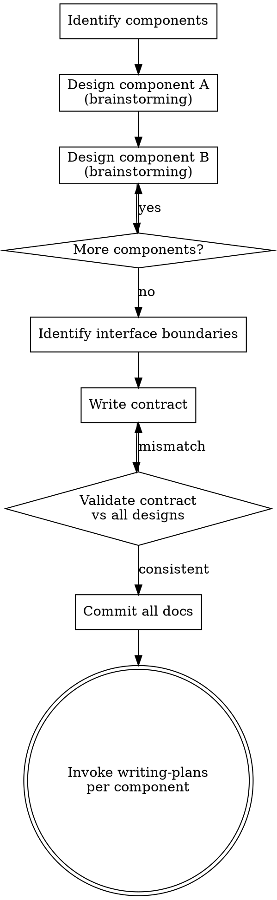

# Contract-Driven Planning

## Overview

Decompose a multi-component system into standalone component designs, then formalize their shared interface as a non-negotiable contract. The contract is the last document written — it emerges from the approved component designs, not the other way around.

**Core principle:** Design components first, contract last. Each document stands alone.

## When to Use

- System has 2+ components sharing an API or data interface
- Components will be implemented by different agents, teams, or sessions
- A monolithic design doc exists that needs decomposition
- You need to enable parallel, independent implementation

**When NOT to use:**
- Single-component systems (use brainstorming directly)
- Components with no shared interface
- Prototyping where the interface is still exploratory

## Process Flow

## Checklist

You MUST create a task for each of these items and complete them in order:

1. **Identify components and boundaries** — list the system's components and what they share
2. **Design each component** — use brainstorming skill for each, producing standalone design docs
3. **Identify interface boundaries** — extract every endpoint, data shape, and convention shared between components
4. **Write the contract** — exact JSON shapes, status codes, conventions, validation rules
5. **Validate contract against designs** — ensure no mismatches between component designs and contract
6. **Save all documents** — write to `docs/plans/YYYY-MM-DD-<feature>/` (directory, not flat file). Plan docs are typically gitignored, so commits aren't expected; instead update `docs/plans/progress.md` with a row pointing to the new directory.
7. **Transition to implementation** — invoke writing-plans per component (each constrained by the contract)

## The Three Deliverables

| Document | Contains | Does NOT contain |
|----------|----------|-----------------|
| Component A design | Full architecture, internal structure, tech stack, testing | References to Component B's internals |
| Component B design | Full architecture, internal structure, tech stack, testing | References to Component A's internals |
| API Contract | Exact JSON shapes, status codes, conventions, validation | Implementation details, architecture decisions |

<HARD-GATE>
Each design document MUST be standalone. No cross-references between component designs. No "see contract section 3.1" links. A reader should understand a component design without opening any other document. The contract is the ONLY document that addresses both sides.
</HARD-GATE>

## Writing the Contract

The contract is written AFTER all component designs are approved. It specifies:

1. **Conventions** — base URL, content types, timestamp format, ID format, property naming, null handling
2. **Error format** — exact error response shape, status code table
3. **Every endpoint** — method, path, request body (exact JSON), response body (exact JSON), errors
4. **Validation rules** — per-field constraints, which status codes each violation produces
5. **Non-negotiable rules** — numbered list of invariants (e.g., "timestamps are always UTC with Z suffix")

**Contract precision standard:** If two developers read the contract independently and implement against it, their implementations should be wire-compatible without coordination.

### Non-Negotiability

The contract header MUST include:

> **This contract is non-negotiable.** Both implementations MUST conform to these exact endpoint paths, request/response shapes, status codes, and conventions. Any deviation during implementation requires updating this contract first and assessing impact on the other side.

This is not decorative — it's the enforcement mechanism. Deviations discovered during implementation do NOT bypass the contract. The flow is: propose change → update contract → assess impact → implement.

## Contract Enforcement: The Lock-Step Test

A contract on paper is not enforcement. Each implementation will pass its own unit tests against the contract as the implementer *understood* it — and the two understandings can diverge silently.

**Required:** for every contract, designate a **lock-step test** that takes a representative artifact, pushes it through the producing component's full pipeline, and feeds the result into the consuming component's validator (the actual Zod / Pydantic / JSON Schema / Avro decoder — not a manual re-implementation). This is the one test that cannot pass while either side has drifted from the contract.

The lock-step test belongs in the producing component's test suite and runs in CI alongside unit tests. It must use the seeded / production-realistic data (not stripped-down fixtures that incidentally avoid the contract's edge cases).

### Passing Gate Example

A contract specified `TextBlock.content: min_length=1`. Both sides shipped matching schemas; both passed their unit tests. But:

- The producer-side resolver was scaffolded with a stub returning `""`.
- A seeded default fixture used blocks that required real resolution.
- The integration test used a stripped-down fixture that incidentally bypassed the stub.
- The "schema parity" test compared shapes, not resolved payloads.

Net result: every producer-side test green, every consumer-side test green, every parity test green. First runtime call against the seeded default → consumer rejected the payload (`content` empty). The wave had been declared complete; the bug was structurally guaranteed.

What would have caught it: a lock-step test that resolves each seeded fixture through the producer's full pipeline and runs the *resolved* output through the consumer's actual schema validator (via subprocess, shared schema package, or a contract test harness). The unit-test pyramid was complete; the cross-boundary test was missing.

**Rule:** "lock-step parity" must mean *fixture-level* parity, not *shape-level* parity. A test that proves both schemas accept the same `{type: "text", content: "x"}` is shape parity. A test that proves the actual seeded artifact survives the round-trip is fixture parity. Only the second one is a passing gate.

## Common Mistakes

| Mistake | Why it fails | Correct approach |
|---------|-------------|-----------------|
| Write contract first, then design components | Contract constrains design prematurely | Design freely, then formalize the interface |
| Component designs cross-reference each other | Creates coupling, breaks standalone readability | Each design is self-contained |
| Contract uses schema references instead of exact JSON | Ambiguous, requires interpretation | Show exact `{ "field": "value" }` examples |
| Contract omits error responses | Implementations handle errors differently | Specify every error status code and message shape |
| Contract includes implementation details | Couples internal decisions across components | Contract = interface only, not internals |
| Add implementation plans to deliverables | Scope creep — that's a separate phase | Use writing-plans skill after contract is committed |

## Quick Reference

| Phase | Tool | Output |
|-------|------|--------|
| Component design | brainstorming skill (per component) | `docs/plans/YYYY-MM-DD-<feature>/<component>-design.md` |
| Contract writing | Manual (informed by all designs) | `docs/plans/YYYY-MM-DD-<feature>/contract.md` |
| Implementation | writing-plans skill (per component) | `docs/plans/YYYY-MM-DD-<feature>/<component>-plan.md` |
| Tracker update | Manual | append row to `docs/plans/progress.md` |

**Naming convention:** one directory per feature (`YYYY-MM-DD-<feature>/`), not flat files. Plan dirs are usually gitignored — `docs/plans/progress.md` is the canonical index of active plans, and is the file that gets committed.

## Key Principles

- **Components first, contract last** — the contract formalizes what the designs already agree on
- **Standalone documents** — each document readable without opening others
- **Exact shapes** — the contract shows `{ "id": "uuid", "title": "string" }`, not "returns a TimeEntry object"
- **Non-negotiable** — deviations update the contract first, never bypass it
- **Interface only** — the contract specifies what crosses the boundary, not how either side works internally
- **YAGNI** — only include what both sides actually need; don't speculatively add endpoints
