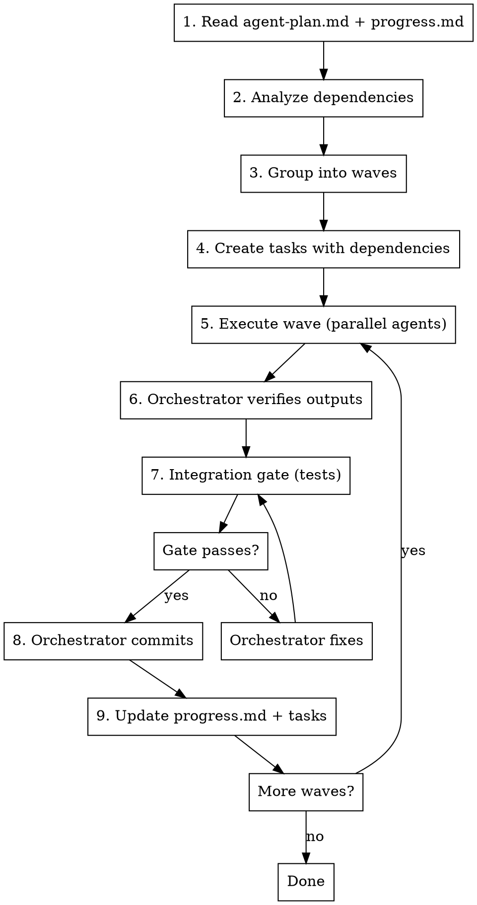

# Orchestrating Agent Waves

## Overview

Execute implementation plans efficiently by grouping independent tasks into **waves** that run in parallel, with **fresh agents** receiving minimal context via **interface summaries**. The orchestrator owns the gating loop: verify, commit, and auto-proceed.

**Core insight:** Parallel execution saves time. Fresh agents with minimal context save tokens and prevent quality degradation. The orchestrator — not the agents — owns commits and progress tracking.

**Required prerequisite:** This skill assumes per-dispatch hygiene (tool-allowlist preflight, silent-failure detection, failure-mode classification). Those rules live in the `agent-preflight` skill. Apply `agent-preflight` Gate 1 before every parallel Agent dispatch in a wave, and Gates 2–3 on every return. This skill governs the *wave* loop; `agent-preflight` governs each *individual* dispatch inside it.

## Dispatch Model: Subagents, Not Teammates

This skill runs **independent** waves — agents that share no runtime state and never message each other. That is the opposite of a coordinated **Team** (see `spawn-team`). The distinction matters because of how dispatch maps onto the harness.

**When the agent-teams harness is active** (`CLAUDE_CODE_EXPERIMENTAL_AGENT_TEAMS=1`, `teammateMode: in-process` in `settings.json`), every `Agent` dispatch is registered as a **teammate / background task** in FleetView. These teammates **do not self-reap when their task completes** — they linger as stale agents, accumulating across waves and consuming context/coordination overhead. A wave run is supposed to leave nothing behind; under the teams flag it leaves a teammate per agent unless you tear them down.

**Two rules keep wave agents ephemeral:**

1. **Spawn anonymous and foreground.** Do *not* pass a `name` and do *not* set `run_in_background` on wave agents. A named agent is addressable via `SendMessage` and is therefore kept alive; a backgrounded agent detaches and persists. Wave workers are throwaway — an unnamed, foreground `Agent` call returns its result inline and is the closest thing to the old fire-and-forget subagent. Reserve named/backgrounded teammates for `spawn-team`, where coordination is the point.
2. **Tear down at the wave teardown step.** After each wave's gate + commit, reap any teammate still alive from this wave before proceeding (see Per-Wave Loop step 5, TEARDOWN). This restores the "fresh agents only, no resume" invariant that the skill assumes.

If the agent-teams flag is **off**, dispatch is already fire-and-forget and the teardown step is a cheap no-op — `TaskList` returns nothing to stop. The rules above are safe in both modes.

## When to Use

- Implementation plan has 10+ tasks across multiple phases
- Tasks have dependencies (Phase 2 needs Phase 1 outputs)
- Multiple tasks within a phase are independent
- You want to maximize parallelization while minimizing token usage

**When NOT to use:**
- Simple plans with <5 sequential tasks
- Tasks require interactive debugging/exploration
- No clear dependency structure

## Workflow



## Core Artifacts

### 1. `agent-plan.md` — Execution Rules

Every plan directory should contain an `agent-plan.md` that codifies execution rules for agents and the orchestrator. This is read once at the start and governs the entire run.

**Standard template:**

```markdown
## Agent Definitions

1. Use Sonnet agents unless specified otherwise.

## Execution Rules

1. Every agent runs the full test suite after completing its changes.
2. If tests fail, the agent diagnoses and fixes autonomously. If the fix touches files owned by another agent, it reports the conflict to the orchestrator.
3. After all agents in a wave complete with green tests, run the full suite as an integration gate before committing.
4. Each wave produces one atomic commit (or one per component if frontend/backend changes are independent).
5. Agents must use Read/Edit/Write/Glob/Grep tools — not bash equivalents for file operations.
6. Never `cd` for git commands; only `cd` for subproject test runners.
```

**Key rules to extract at session start:**
- Agent model (sonnet/opus)
- Per-agent test commands
- Integration gate commands (may differ — e.g., `tsc --noEmit` for agents vs `tsc -b` for build gate)
- Commit granularity (per-wave, per-component, etc.)
- Tool usage constraints

### 2. `progress.md` — Wave-Level Tracking

The plan directory's `progress.md` tracks planning deliverables AND implementation wave status. The orchestrator updates it after each successful gate. For plans authored via `writing-plans`, this file is scaffolded at plan-save time (all waves Pending); if missing, create it before dispatching Wave 1.

**Structure:**

```markdown
# Feature — Progress

Last updated: YYYY-MM-DD

## Planning Phase (complete)

| Deliverable | Status |
|-------------|--------|
| Design doc A | Done → `design-a.md` |
| Contract | Done → `contract.md` |
| Wave plan | Done → `waves.md` |

## Key Decisions

| Decision | Choice | Rationale |
|----------|--------|-----------|
| ... | ... | ... |

## Implementation Phase

| Wave | Agents | What | Status |
|------|--------|------|--------|
| 1 | 1 | Contract types | Done — `abc1234` |
| 2 | 2 parallel | Renderer + configs | Done — `def5678` |
| 3 | 2 parallel | Migrate editors | In Progress |
| 4 | 0 | Verification gate | Pending |

## Actual Impact

- ~400 lines removed, ~200 lines added
- 36 fields migrated
```

**Update protocol:** After each wave's commit, the orchestrator updates the Status column with `Done — {commit_hash}`. On completion, fill in the Actual Impact section.

### 3. Wave Definition (in `waves.md`)

Group tasks by dependency:

```markdown
## Wave N: [Focus]
**Dependencies:** Wave N-1 complete

| Agent | Task | Output |
|-------|------|--------|
| N.1 | [Description] | `path/to/file` |
| N.2 | [Description] | `path/to/other` |

### Wave N Gate

{gate_commands}

Expected: {pass_criteria}
```

**Rule:** All agents in a wave must write to **distinct files**.

#### Gate Design: Cross-Boundary Tests Are Mandatory

A gate that runs unit tests on each component independently is **not** a passing gate when the wave's output crosses a contract boundary (resolver → renderer, schema → consumer, producer → subscriber). Cross-boundary defects survive unit tests because each side is internally consistent.

**Passing gate pattern:** at least one test in the gate must take a representative artifact, push it through the producing component, and feed the result into the consuming component's validator.

**Failure case (anonymized).**
A 5-wave plan shipped with all unit tests green. A resolver was scaffolded in an early wave with a stub returning `""`; the seeded default fixture used blocks that required real resolution; a later wave wired them together; the wave was declared complete. Any use of the seeded default produced output that the downstream component's schema rejected at runtime — a guaranteed validation failure shipped as "done."

The unit tests that passed:
- Producer-side tests used fixtures with populated source fields → never exercised the empty-output path.
- Stub-return tests asserted `isinstance(result, str)` — stubs returning `""` passed.
- The integration test used a stripped-down template that incidentally bypassed the stubbed code path.
- A "schema parity" test compared shapes, not resolved fixtures.

**What would have caught it (passing gate for the same wave):**

```markdown
### Wave N Gate

# Unit (per component, as usual)
{component_unit_tests}

# Cross-boundary integration — REQUIRED when a wave produces data
# consumed by another component's validator.
{e2e_test_using_seeded_realistic_fixture}
#   asserts: end-to-end call → success
#   asserts: captured downstream payload contains no scaffolding
#            artifacts (e.g., empty strings, placeholder objects)

# Schema parity — resolved fixtures validated against the downstream
# schema (not just shape-equivalence between the two schemas).
{fixture_parity_test}
#   resolves each seeded artifact with a realistic fixture, then
#   validates the JSON against the downstream component's actual
#   schema (e.g., via subprocess into the other language's validator).

Expected: green across all three.
```

**Heuristic for designing gates:** for every wave, ask *"what artifact does this wave produce, and which downstream component consumes it?"* If the answer crosses a process/language/schema boundary, the gate must include at least one test that crosses that same boundary.

#### Shipped-Stub Tracking

If a wave intentionally ships a stub or placeholder that a later wave must implement, `agent-plan.md` or `progress.md` MUST list the un-stub task as an explicit follow-up — never absorb it implicitly into a later wave's scope. A `TODO(WAVE-X.Y)` comment in code is not a substitute; the plan is the source of truth for wave deliverables.

### 4. Interface Summary

Maintain `interfaces.yaml` **in the planning docs directory** alongside the design docs. Use one directory per topic: `docs/plans/YYYY-MM-DD-<feature>/interfaces.yaml`, not flat files. Planning artifacts belong with the plan, not in `.claude/context/`.

**Note:** `docs/plans/` subdirectories are typically gitignored, so the interface summary lives only in the working tree. The top-level index `docs/plans/progress.md` tracks active plan directories (distinct from the plan-local `progress.md` described in Section 2). When you start a new plan, add a row to the top-level index; when the plan ships, remove the row (or move the directory to `archived/`).

```yaml
backend:
  models: |
    class Foo(BaseModel):
        id: str
        name: str
  functions: |
    def process(foo: Foo) -> Result: ...

frontend:
  types: |
    interface Foo { id: string; name: string; }
```

**Contains:** Type signatures, function signatures, usage patterns
**Omits:** Implementation details, full file contents

**Update at:** Verification gates (every 3-4 waves)

### 5. Agent Prompt Template

```markdown
# Task: {task_name}

## Objective
{description}

## Output Files
{paths}

## Interfaces (from previous waves)
{interface_summary_excerpt}

## Design Spec
{relevant_section_only}

## Reference (if needed)
{code_excerpt_not_full_file}

## File to Extend (if applicable)
{current_content}
```

**Target:** 5-10K tokens per agent (consistent regardless of wave number)

## Orchestrator Gating Protocol

The orchestrator — not individual agents — owns the commit-test-proceed loop. This is the critical difference from ad-hoc agent dispatch.

### Pre-Flight (once per session)

0. **Apply `agent-preflight` Gate 1** to every agent slot in the wave before any dispatch: declare required tools, pick a `subagent_type` that has them, state the output contract (artifact path + shape), and bound scope. Mismatches here are the most common silent-wave-failure cause.
1. **Read `agent-plan.md`** — extract model, test commands, gate commands, commit rules
2. **Read `progress.md`** — find current wave status, skip completed waves
3. **Read `waves.md`** — load wave definitions, agent prompts, gate criteria
4. **Read existing code** — orchestrator reads files agents will touch (for context injection into prompts)
5. **Produce a SCOPE CONTRACT and wait for user approval** — see below. **Do not spawn any agents until the user approves it.**
6. **Create tasks with dependencies** — one task per wave, blockedBy previous wave

### SCOPE CONTRACT (required before any agent dispatch)

Before launching any agents, the orchestrator MUST produce a written SCOPE CONTRACT and wait for explicit user approval. This is a hard gate — no Agent calls until approved.

The contract is a short markdown block with these four sections:

1. **Allowed directories** — exact paths agents may create/modify files in (e.g., `backend/src/myapp/design/`, `frontend/src/pages/foo/`).
2. **Off-limits directories** — paths agents must NOT touch (e.g., `packages/myapp-schema/`, `docs/plans/`, anything outside the named worktree).
3. **Test files that must be updated** — production code changes require matching test updates; list the test files or directories per wave (e.g., "any new field on `OptimizationRun` requires an update to `tests/orm/test_optimization.py`").
4. **Verification command** — the exact command the user will run before approving each wave's commit (e.g., `cd backend && uv run pytest tests/design/ -v`). One per wave if they differ.

**Format:**

```markdown
## SCOPE CONTRACT

**Allowed:**
- backend/src/myapp/foo/
- frontend/src/pages/foo/

**Off-limits:**
- packages/
- docs/plans/ (gitignored — never commit)
- any path outside the current worktree

**Test files required per wave:**
- Wave 1 (schema): backend/tests/orm/test_foo.py
- Wave 2 (API):    backend/tests/api/test_foo_router.py
- Wave 3 (UI):     frontend/src/pages/foo/__tests__/

**Verification command per wave:**
- Wave 1: `(cd backend && uv run pytest tests/orm/test_foo.py -v)`
- Wave 2: `(cd backend && uv run pytest tests/ -v)`
- Wave 3: `(cd frontend && npm test -- foo)`

Awaiting approval before spawning agents.
```

After printing the contract, **stop and wait**. Do not proceed to step 6 (task creation) or any Agent dispatch until the user replies with approval (e.g., "proceed", "approved", "yes"). If the user requests edits, revise the contract and re-await approval.

### Per-Wave Loop

```
For each wave (in order):

1. LAUNCH — Parallel agents in a single message
   - Apply `agent-preflight` Gate 1 to each agent (tools declared, subagent_type matched, output contract stated, scope bounded)
   - Spawn **anonymous + foreground** (no `name`, no `run_in_background`) so agents stay ephemeral — see Dispatch Model
   - Sonnet model by default (per agent-plan.md)
   - Each agent gets: task prompt + interface summary + relevant code excerpts
   - Agents run their own test suite and self-fix

2. VERIFY — Orchestrator reads agent outputs
   - Apply `agent-preflight` Gate 2 per agent return: output non-empty? declared artifact present? scope respected? quality plausible?
   - On any Gate 2 failure, classify via `agent-preflight` Gate 3 taxonomy and re-dispatch fresh (max 2 retries per agent)
   - Read each created/modified file to confirm correctness
   - Check for cross-agent conflicts (shouldn't happen if files are distinct)

3. GATE — Orchestrator runs integration tests
   - Run gate commands from waves.md (e.g., tsc --noEmit, vitest, npm run build)
   - If gate fails: orchestrator diagnoses and fixes (not the agent)
   - Re-run gate until clean

4. COMMIT — Orchestrator creates atomic commit
   - One commit per wave (or per component if frontend/backend split)
   - Conventional commit message reflecting the wave's purpose
   - Stage only the files from this wave (not `git add -A`)

5. TEARDOWN — Reap stale teammates (agent-teams harness only)
   - Run `TaskList`; any teammate spawned for this wave that is still listed (not reaped) is a stale agent
   - `TaskStop` each one by its `task_id` before proceeding
   - Anonymous foreground agents (per LAUNCH) usually reap themselves on return — this step is the backstop for any that linger, and a no-op when the teams flag is off
   - Do NOT carry a wave's agents into the next wave (violates "fresh agents only")

6. UPDATE — Mark wave complete
   - Update task status to completed
   - Update progress.md with commit hash (if tracking in working tree)
   - Confirm no stale wave agents remain (TEARDOWN ran clean)
   - Proceed to next wave automatically if gate passed
```

### Auto-Proceed Rule

When the user says "proceed with the next wave if the current passes tests" (or similar), the orchestrator runs the full loop without pausing between waves. The only stop conditions are:

- A gate fails and the orchestrator cannot self-fix
- All waves are complete
- The user interrupts

### Gate Failure Protocol

1. **Orchestrator diagnoses** — read error output, identify root cause
2. **Classify the failure:**
   - **Our change:** Fix it, re-run gate, commit the fix as a separate atomic commit
   - **Pre-existing:** Verify it exists on the parent commit, note it, proceed
   - **Cross-agent conflict:** Should not happen (distinct files rule), but if it does, orchestrator resolves
3. **Never re-launch an agent to fix a gate failure** — the orchestrator has full context and fixes are typically 1-3 lines

### Pre-Existing vs Introduced Failures

When a gate reveals failures, always distinguish:
- **Stash or checkout parent commit** to verify the failure exists before your changes
- Document pre-existing failures in the wave summary (don't block on them)
- Only fix failures introduced by the current wave

## Invariants

| Rule | Why |
|------|-----|
| Agent context ≤ 15K tokens | Prevents quality degradation |
| All same-wave agents write distinct files | Prevents merge conflicts |
| Wave N waits for Wave N-1 gate | Ensures dependencies exist |
| Interface summary updated at gates | Downstream agents know what exists |
| Fresh agents only (no resume) | Prevents context accumulation |
| Wave agents spawned anonymous + foreground | Named/backgrounded agents become persistent teammates under the agent-teams flag and don't self-reap |
| No stale teammates after a wave | Teardown step reaps any teammate the agent-teams harness left alive; keeps "fresh agents only" true |
| Orchestrator owns commits | Agents don't commit; orchestrator verifies first |
| Orchestrator owns gate fixes | Agent re-launch is wasteful for 1-3 line fixes |
| agent-plan.md read once at start | Consistent rules across all waves |
| progress.md updated per wave | Enables session resumption and progress visibility |
| SCOPE CONTRACT approved before any Agent dispatch | Prevents boundary drift, missed test updates, surprise edits |
| `agent-preflight` Gates 1–3 applied per agent | Prevents silent failures, permission gaps, and wrong-subagent-type dispatches inside an otherwise well-planned wave |

## Anti-Patterns

| Don't | Do Instead |
|-------|------------|
| Resume agents across waves | Fresh agent + interface summary |
| Name or background wave agents (makes them persistent teammates) | Spawn anonymous + foreground; reserve named teammates for `spawn-team` |
| Leave teammates running after a wave completes | `TaskList` + `TaskStop` stale agents in the teardown step |
| Inject full reference files | Extract specific excerpts |
| Launch agents in separate messages | Single message, multiple Task calls |
| Skip verification gates | Test before proceeding |
| Let agents explore to find context | Inject exactly what they need |
| Let agents commit | Orchestrator verifies outputs then commits |
| Re-launch agent to fix gate failure | Orchestrator fixes directly (1-3 lines) |
| Pause between waves when told to auto-proceed | Run the full loop, stop only on failure |
| Mix wave changes into one commit | One atomic commit per wave |
| Use `git add -A` for commits | Stage specific files from the wave |

## Plan Directory Layout

A complete plan directory looks like:

```
docs/plans/YYYY-MM-DD-<feature>/
├── agent-plan.md        # Execution rules for agents + orchestrator
├── progress.md          # Planning + implementation status (updated per wave)
├── waves.md             # Wave definitions with agent prompts + gate commands
├── interfaces.yaml      # Type/function signatures (updated at gates)
├── contract.md          # Interface contract (if applicable)
├── design-a.md          # Design doc (component A)
├── design-b.md          # Design doc (component B)
└── ...                  # Additional design/reference docs
```

**Required:** `agent-plan.md`, `progress.md`, `waves.md`
**Recommended:** `interfaces.yaml`, `contract.md`
**Optional:** Design docs, reference docs

## Token Budget

| Component | Tokens |
|-----------|--------|
| Interface summary | ~1-2K |
| Design section | ~1-2K |
| Reference excerpt | ~500-1K |
| File to extend | ~2-5K |
| Task prompt | ~500 |
| **Total per agent** | **~5-10K** |

**Savings:** ~80% vs naive (each agent reading all files)

## Quick Start

1. **Read plan** → `agent-plan.md` (rules), `progress.md` (status), `waves.md` (definitions)
2. **Print SCOPE CONTRACT and wait for user approval** → allowed dirs / off-limits dirs / required test files / per-wave verification command. No Agent dispatch until approved.
3. **Create tasks** → One per wave, with blockedBy dependencies
4. **Execute Wave 1** → Single message, parallel Agent calls — anonymous + foreground (sonnet by default)
5. **Verify outputs** → Orchestrator reads created/modified files
6. **Run gate** → Integration test commands from waves.md
7. **Commit** → Atomic commit, stage specific files only
8. **Teardown** → `TaskList` + `TaskStop` any stale wave teammate (agent-teams harness; no-op if flag off)
9. **Update tracking** → Mark task completed, update progress.md with commit hash
10. **Auto-proceed** → Next wave immediately if gate passed and user authorized
11. **On completion** → Update top-level `docs/plans/progress.md` index (move dir to `archived/`)
